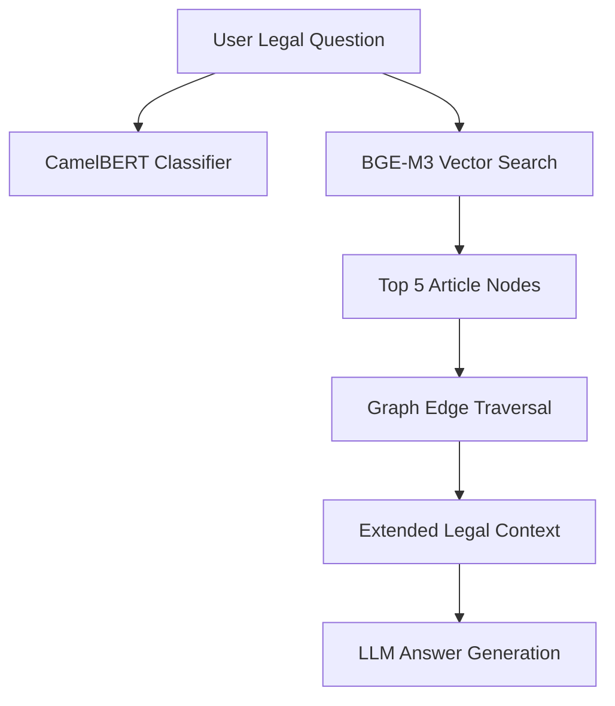

# Istacherni Graph RAG Technical Report

## 🌐 The Relational Intelligence Layer
Istacherni utilizes a **Local Graph RAG** (Retrieval-Augmented Generation) architecture to go beyond simple keyword matching. By mapping the intricate relationships between Algerian laws, articles, and legal concepts, the system can reason through complex legal dependencies.

### 🏗️ Knowledge Graph Architecture
The graph is built using `NetworkX` and persisted locally as a serialized knowledge base. It consists of a directed heterogeneous network:

| Node Type | Purpose |
| :--- | :--- |
| **Article** | The core unit, containing JORADP text, summaries, and penalties. |
| **Law / Code** | Groups articles under their parent legislation (e.g., Code Civil). |
| **Domain** | High-level categorization (Labor, Commercial, Penal). |
| **Concept** | Extracted keywords and legal definitions (e.g., "Force Majeure"). |
| **Penalty** | Categorized punishments (Imprisonment, Fines, Confiscation). |

---

## 🧬 Relationship Mapping
Unlike a standard database, the Graph RAG understands **linkage**:
1.  **RELATED_TO**: Explicit cross-references between articles (e.g., Article 12 refers to Article 5).
2.  **SAME_LAW**: Cluster articles that share the same legislative origin.
3.  **HAS_PENALTY**: Connects infractions to specific legal consequences.
4.  **IN_DOMAIN**: Contextualizes the law within the Algerian legal hierarchy.

---

## 🔍 The Retrieval Engine: Hybrid Semantic-Graph
The system employs a multi-stage retrieval process:

### 1. Semantic Embedding (BGE-M3)
- All article nodes are embedded using the **BGE-M3** model (state-of-the-art for multilingual retrieval).
- **Local Execution**: Embeddings are computed and cached locally, ensuring 100% data privacy and offline capability.

### 2. Graph Traversal (Context Expansion)
- When a query is matched to a node, the system traverses edges to find **"Neighboring Context"**.
- If Article A is relevant, the system automatically pulls Article B (cross-referenced) and the parent Law's general principles.

### 3. CamelBERT Classification
- For ambiguous legal queries, the system uses a fine-tuned **CamelBERT** classifier.
- **Domain Reasoning**: It can distinguish between "Substantive Law" (rights/duties) and "Procedural Law" (court steps) to provide more accurate answers.

---

## ⚡ Performance Features
- **Smart Ingestion**: The `GraphBuilder` reuses existing node embeddings if the source text hasn't changed, reducing build times from minutes to seconds.
- **Penalty Analytics**: Automatically classifies penalties into categories (Death Penalty, Life Imprisonment, Temporary Imprisonment) using a specialized regex rule engine.
- **Persistent Cache**: The entire graph and corpus are cached in `law_graph_local.pkl`, allowing for instant server starts.

---

## 🛠️ Retrieval Flow

---
**Implementation**: `graph_rag_local/` | **Engine**: `NetworkX` | **Embeddings**: `BGE-M3 (Local)`
